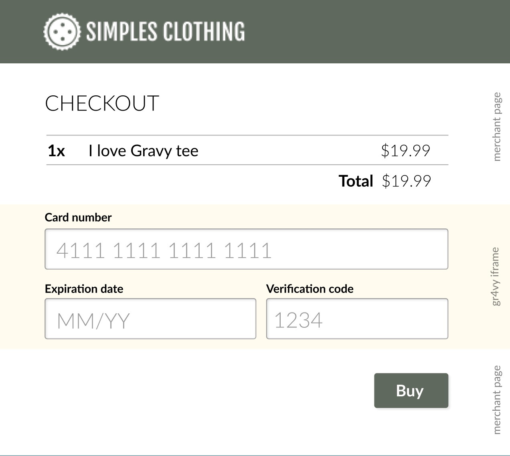

# Hosted UI integration & API calls

The following is an example of how the hosted UI will be used by customers.

## 1a. Drop-in UI for tokenization inside a form

This form tokenizes a card in a Hosted UI, and then passes the card ID back to the page that loaded the Hosted UI. This card ID is then submitted to the merchant server, where the merchant can then process the card and create and capture an authorization. 

### 1a.1 - Merchant generates JWT (Server)

The merchant generates a front-end specific signed JWT token on their server-side and shares this with the frontend.

```js
import Gr4vy from 'gr4vy'

const client = new Gr4vy({ 
  privateKeyFileName: './private.key' 
})

const token = client.frontend.token()
```

> These examples are in JS but the same principles apply in other languages.

### 1a.2 - Merchant uses JWT token to initialize the drop-in UI

Next, the merchant inject this token into their front-end. They then load our hosted UI library and initializes it, This embeds the UI inside the form.

```html
<!DOCTYPE html>
<html lang="en">
<head>
  <script src="https://merchant.cdn.gr4vy.com/hosted-ui-v1.0.min.js"></script>
</head>
<body>
  <form action="/process" method="POST">
    <div id='card' />
    <input type='submit' value='Submit'>
  </form>
  <script>
    gr4vy.setup({
      token: <%= token %>,
      element: 'card'
    })
  </script>
</body>
</html>
```

> The `<%= token %>` here inserts the server-side generated token into the page. This will be different depending on the language used.

This will embed the UI in an `iframe` in a page as follows.



### 1a.3 Consumer fills in details and submits form

> This is code implemented by Gr4vy, not the merchant

Once the customer fills in the form and submits the form, the following will happen.

1. `hosted-ui-v1.0.min.js` intercepts the form submission and cancels it
2. `hosted-ui-v1.0.min.js` then notifies the `iframe` of the form submission
3. The `iframe` then gathers all the card details and sends them to the API 
   * `POST /cards` with an authorization header `Authorization: bearer [token]` where `[token]` is the JWT token generated in step `1a.1`
4. The `iframe` receives a `Status` object with a new `card.id`.
5. The `iframe` uses websockets or polling to wait for the `card` to be created fully
6. The `iframe` notifies `hosted-ui-v1.0.min.js` of the new `card.id` once it has been fully created
7. The `hosted-ui-v1.0.min.js` inserts a the `card.id` into the form as a new hidden `input`
8. The ``hosted-ui-v1.0.min.js` submits the form and the page redirects to the `form`'s `action` URL.

> Question: does the hosted UI **need** to wait for the card to be created?

### 1a.4 Merchant uses card for transaction

The merchant now uses the new `card.id` to create a transaction. They first create the transaction, and then redirect the user to wait for the transaction to complete.

```js
app.post('/process', function (req, res) {
  const card_id = req.body.card_id

  // use the card ID to auth/capture
  client.transactions.authorizations.post({
    amount: 1299,
    currency: "USD",
    payment_method_type: "card",
    capture: true,
    payment_method: {
      id: card_id
    }
  })
  // Redirect the customer to a page that waits for
  // the transaction to complete
  res.redirect('/wait')
})
```

> Question: in our current API spec this requires the card number, not the card ID to create an authorization. Which one is desired?

## 1b. Drop-in UI for tokenization with React

This form tokenizes a card in a Hosted UI, and then passes the card ID back to the page that loaded the Hosted UI. This is the same flow as `1a` but using a React (JAMStack) approach for our more advanced customers.

### 1b.1 - Merchant generates JWT (Server)

The merchant generates a front-end specific signed JWT token on their server-side and shares this with the frontend through their own API

```js
import Gr4vy from 'gr4vy'

const client = new Gr4vy({ 
  privateKeyFileName: './private.key' 
})

// The merchant could use any kind of auth here to make sure this API can only be 
// accessed by their own frontend, for example cookies
app.get('/token', function (req, res) {
  res.json({
    token: client.frontend.token()
  })
})
```

> These examples are in JS but the same principles apply in other languages.

### 1b.2 - Merchant uses JWT token to initialize the drop-in UI

Next, the merchant would load our React library and initialize their own form component.

```js
import React, { useEffect, useState } from 'react'
import axios from 'axios'
import { CardForm } from 'gr4vy-react'

const CardFormController = () => {
  // the controller starts without a token
  const [token, setToken] = useState(null)

  // when the UI loads, load a token
  useEffect(async () => {
    const result = await axios.get('/token')
    setToken(result.token)
  }, [])

  return (
    // this component for would need to be able to handle 
    // a null-token
    <CardForm token={ token } />
  )
}

export default CardFormController
```

> The `useEffect` and `useState` methods here are React methods used for managing state in a react app. The `useEffect` is used to load dynamic content like our token on page load.

This will embed the card form into the page in an `iframe`. We can expose additional components for more complex UI as seperate elements.

```js
import { CheckoutForm } from 'gr4vy-react'
```

### 1b.3 Consumer fills in details and submits form

> This is code implemented by Gr4vy, not the merchant

Once the customer fills in the form and submits the form, the following will happen.

1. `CardForm` intercepts the form submission and cancels it
2. `CardForm` then notifies the `iframe` of the form submission
3. The `iframe` then gathers all the card details and sends them to the API 
   * `POST /cards` with an authorization header `Authorization: bearer [token]` where `[token]` is the JWT token generated in step `1a.1`
4. The `iframe` receives a `Status` object with a new `card.id`.
5. The `iframe` uses websockets or polling to wait for the `card` to be created fully
6. The `iframe` notifies parent page of the new `card.id`.

> Question: does the hosted UI **need** to wait for the card to be created?

### 1b.4 Merchant handles event for new card ID.

Building on the previous `CardFormController`, we can extend the code to add a handler for the new `card.id`.

```js
import React, { useEffect, useState } from 'react'
import axios from 'axios'
import { CardForm } from 'gr4vy-react'

const CardFormController = () => {
  ...

  const processPayment = ({ card_id }) => {
    // sends the card ID to their own server. 
    axios.post('/process', { card_id: card_id })
      // the user can update the UI or redirect a user
      // once their own API returns successfully with the 
      // details of the pending transaction
      .then(updateUI)
  }

  return (
    <CardForm 
      token={ token } 
      onSuccess={processPayment} 
    />
  )
}

export default CardFormController
```

### 1b.4 Merchant uses card for transaction

The merchant now uses the new `card.id` to create a transaction. They first create the transaction, and immediately return the status to the frontend.

```js
app.post('/process', async function (req, res) {
  const card_id = req.body.card_id

  // use the card ID to auth/capture
  const status = await client.transactions.authorizations.post({
    amount: 1299,
    currency: "USD",
    payment_method_type: "card",
    capture: true,
    payment_method: {
      id: card_id
    }
  })
  // Return the status object to the frontend
  res.json(status)
})
```

> Question: in our current API spec this requires the card number, not the card ID to create an authorization. Which one is desired?

## 2. Drop-in UI for tokenization, authorization, and capture

[TBD]

## 3. Check-out button

[TBD]


